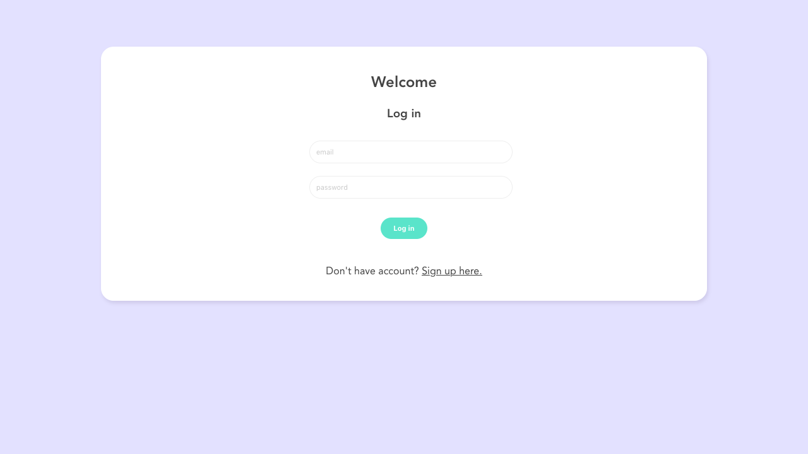
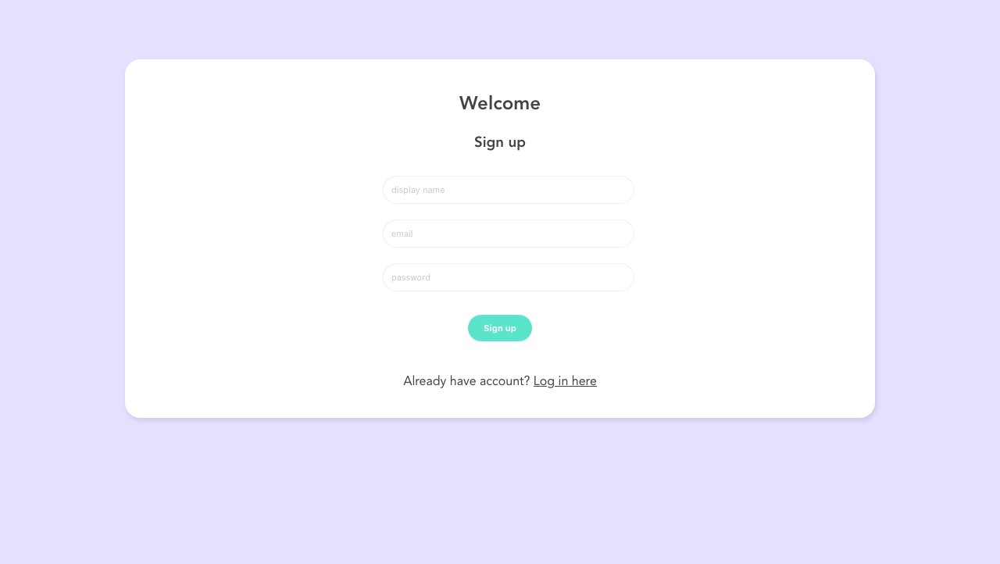
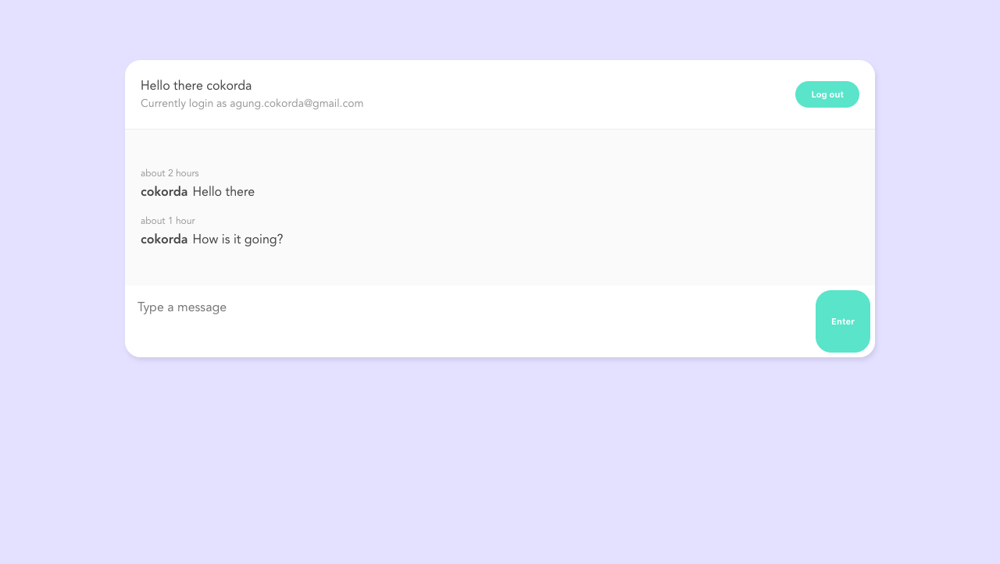

# Live Chatroom

> Live Chatroom is a simple messaging app for everyone.

## Table of contents

- [General info](#general-info)
- [Screenshots](#screenshots)
- [Setup](#setup)
- [Inspiration](#inspiration)

## General info

Live Chatroom is a messaging app built using Vue 3 as the frontend and Firebase as the backend. Its dependencies including `vue-router` and `date-fns`.
Users can sign-up for the first time by providing display name, email, and password. After signing up, users would get into the chatroom where they can send messages real time.

## Screenshots





## Setup

1. Clone this repo
2. Install dependencies `$ npm install`
3. Make a new project in [Firebase](https://console.firebase.google.com/)
4. Register app in Firebase
5. Copy the config snippet, make a new `firebase` folder inside `src` folder. Inside `firebase` folder, make a new `config.js` file and include your copied config snippet.

```
  import firebase from "firebase/app";
  import "firebase/firestore";
  import "firebase/auth";

  // paste your config snippet below to replace example
  const firebaseConfig = {
    apiKey: "example",
    authDomain: "example",
    projectId: "example",
    storageBucket: "example",
    messagingSenderId: "example",
    appId: "example",
  };

  // init firebase
  firebase.initializeApp(firebaseConfig);

  // init authentication
  const projectAuth = firebase.auth();
  // init firestore
  const projectFirestore = firebase.firestore();
  const timestamp = firebase.firestore.FieldValue.serverTimestamp;

  export { projectAuth, projectFirestore, timestamp };
```

6. Enable Email/Password Sign-in Method under Authentication menu
7. Create Firestore database under Firestore menu
8. Install firebase-tools `$ npm install -g firebase-tools`
9. Login to your firebase account `$ firebase login`
10. Initialize firebase `$ firebase init`. Type `dist` as your public folder
11. Build the app `$ npm run build`
12. Deploy the app `$ firebase deploy`

## Inspiration

Project is based on Vue project by [@iamshaunjp](https://github.com/iamshaunjp)

## License

MIT
